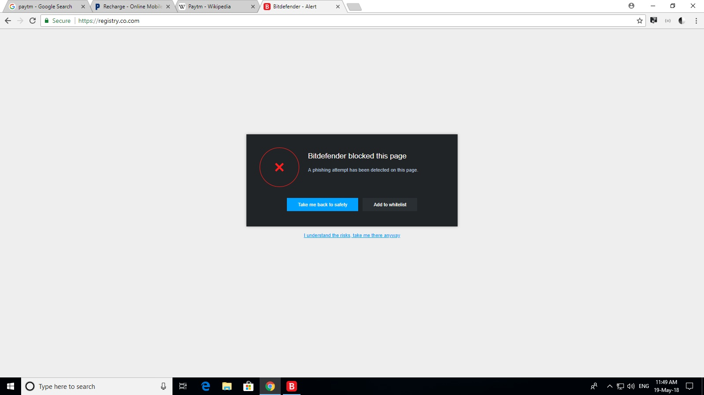

# Animal

This is Animal app which storage Animal Data.It is an Example that show's how to store data in DataBase in Android.

* Use Components:-
1) Sqlite.
2) ListView.
3) FloatingButton.

* Get more Details From this Link:- 

https://www.tutorialspoint.com/android/android_sqlite_database.htm

Screenshot:-

'''

    public static void main(String[] args) {
        double[] arr = {19, 12.89, 16.5, 200, 13.7};
        double total = 0;

        for(int i=0; i<arr.length; i++){
        	total = total + arr[i];
        }

        /* arr.length returns the number of elements 
         * present in the array
         */
        double average = total / arr.length;
        
        /* This is used for displaying the formatted output
         * if you give %.4f then the output would have 4 digits
         * after decimal point.
         */
        System.out.format("The average is: %.3f", average);
    }
'''

This site was built using [GitHub Pages](https://pages.github.com/).
